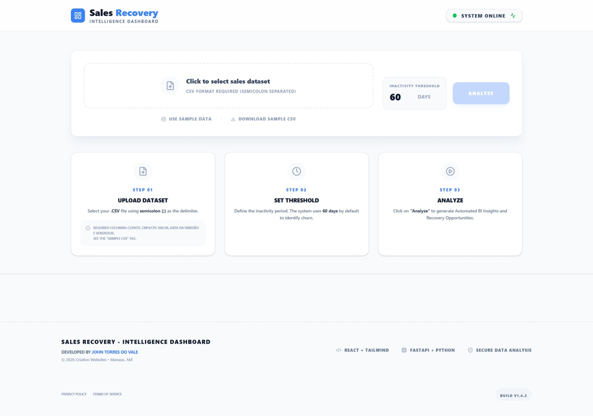
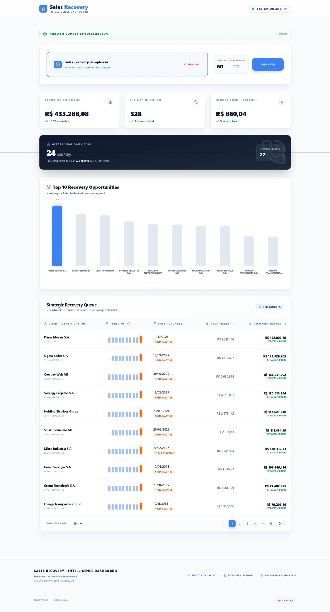
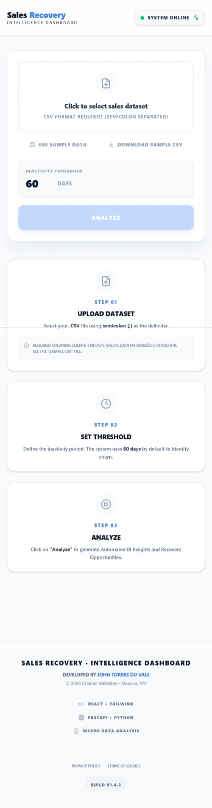
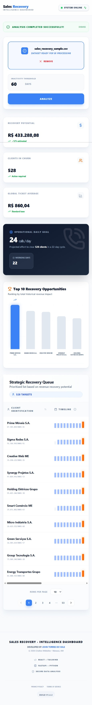

# 📊 Sales Recovery - Intelligence Dashboard | Frontend

### 📖 Overview
This is the professional web interface for the Sales Recovery BI Engine. Built with a focus on User Experience (UX) and Data Visualization, this frontend allows sales managers to upload complex datasets and receive a clean, strategic dashboard in seconds. The application is fully responsive, ensuring that strategic decisions can be made on both desktop and mobile devices.

Click [here 🚀](https://sales-recovery-frontend.vercel.app/) to access the live application.<br>
❗IMPORTANT: the frontend is designed to work with the FastAPI backend. Wait until the backend is ready before testing the frontend functionalities.

### ✨ Key Features
- Intelligent CSV Upload: Includes pre-flight validation for file format, size, and data integrity.
- Sample Data Simulation: Allows users to test the platform's intelligence with a single click using an internal "Sample Data" loader.
- Dynamic BI Dashboard: Once processed, the UI renders real-time KPI cards, recovery focus charts, and an operational goal tracker.
- Strategic Table View: A detailed list of churned clients with specific metrics like last purchase date and historical ticket average.
- Responsive Design: Optimized layouts for all screen sizes using a mobile-first approach.
- Real-time Feedback: Integrated StatusFeedback component to communicate backend errors (like missing columns or empty files) clearly to the user.

### 🛠️ Technology Stack
- React 18: Core library for the component-based architecture.
- Vite: Next-generation frontend tooling for fast development and optimized builds.
- Tailwind CSS: Utility-first CSS framework for custom professional styling and responsiveness.
- Lucide React: For clean, consistent, and semantic iconography.
- Recharts: Powering the interactive strategic visualization charts.

### 📸 Screenshots

**Desktop Experience**
- Initial State (Idle):
  
  

- Analysis Results (Dashboard):
  
  

**Mobile Experience**
- Initial State (Idle):
  
  

- Analysis Results (Dashboard):
  
  

## 📁 Project Structure

```text
sales-recovery-frontend/
├── public/              # Static public assets (Favicon, icons)
├── screenshots/         # Application previews (Desktop/Mobile)
├── src/
│   ├── assets/          # Global images and media files
│   ├── components/      # Modular UI components (KPIs, Charts, Tables, Feedback)
│   ├── data/            # Local sample datasets (sales_fictitious_data.csv)
│   ├── services/        # API communication logic (Vite)
│   ├── styles/          # Tailwind CSS global styles and configurations
│   ├── App.jsx          # Main application orchestrator
│   └── main.jsx         # React application entry point
├── index.html           # Main HTML document
├── package.json         # Project dependencies and automation scripts
├── tailwind.config.js   # Tailwind CSS theme customization
├── vite.config.js       # Vite build tool configuration
└── README.md            # Frontend documentation
```

### ⚙️ Getting Started
1. Install Dependencies: npm install
2. Environment Setup: Ensure your backend is running at http://localhost:8000.
3. Run Development Server: npm run dev
4. Open in Browser: Navigate to http://localhost:5173 to access the application.
* This frontend application depends on the FastAPI backend to process uploaded CSV files and return the necessary data for visualization. Ensure that the backend is properly set up and running before testing the frontend functionalities.


### 📄 License
Developed by John Torres do Vale - Criativo Websites. Internal use only for strategic business intelligence.
